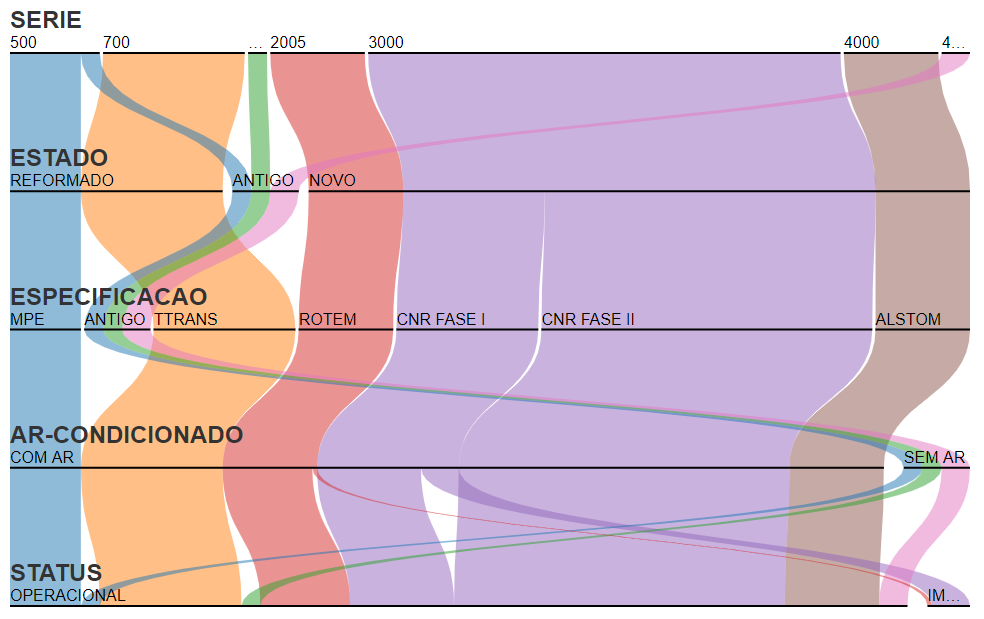

# d3.parsets

Datasets experimentation with the interactive parallel sets visualisation for D3.js, originally available at http://www.jasondavies.com/parallel-sets and based on [Parallel Sets](http://eagereyes.org/parallel-sets) by Robert Kosara and Caroline Ziemkiewicz.

Sample datasets:

[Empresas de Ônibus](https://pedroprio.github.io/d3-parsets/analise_mercado_empresas_onibus.html)

[Frota SuperVia](https://pedroprio.github.io/d3-parsets/analise_frota_supervia.html)

## Original API information

<a name="d3_parsets" href="#d3_parsets">#</a> d3.<b>parsets</b>()

Creates a new parallel sets chart with default settings: dimensions are automatically detected and the size is 960×600. The chart is a function that can be called on any D3 selection that has data bound to it.  This function can be configured as described below.

<a name="parsets_dimensions" href="#parsets_dimensions">#</a> parsets.<b>dimensions</b>(<i>dimensions</i>)

If *dimensions* is specified, sets the categorical dimensions to be visualised. If a function is specified, it is invoked for every element in the target selection and an array of dimension names is expected in return. If an array is specified, it should be an array of dimension names (object keys).

If *dimensions* is not specified, returns the current dimensions.

<a name="parsets_value" href="#parsets_value">#</a> parsets.<b>value</b>(<i>value</i>)

Specifies the value accessor. If *value* is not specified, returns the current value accessor. The default accessor simply returns 1 for each input data element i.e. the absolute frequency count. This value is used to set the width of the horizontal bars and connecting ribbons in proportion to the value.

If the input data is a pivot table, you’ll want to set this to return the aggregate sum for each input data element.  You could also use an arbitrary numerical measure instead of frequency if appropriate.

<a name="parsets_width" href="#parsets_width">#</a> parsets.<b>width</b>(<i>width</i>)

Specifies the chart width in pixels. If *width* is not specified, returns the current width, which defaults to 960.

<a name="parsets_height" href="#parsets_height">#</a> parsets.<b>height</b>(<i>height</i>)

Specifies the chart height in pixels. If *height* is not specified, returns the current height, which defaults to 600.

If a negative height is specified, this causes the dimensions to be reversed vertically, and you need to set the appropriate translate transform in the chart’s parent `<g>` element.

<a name="parsets_spacing" href="#parsets_spacing">#</a> parsets.<b>spacing</b>(<i>spacing</i>)

Specifies the total amount of spacing in pixels to be divided between the horizontal category bars. If *spacing* is not specified, returns the current spacing, which defaults to 20.

<a name="parsets_tension" href="#parsets_tension">#</a> parsets.<b>tension</b>(<i>tension</i>)

Specifies the tension for the ribbon curves. This should be a value between 0 and 1 inclusive. If *tension* is not specified, returns the current tension, which defaults to 1 (straight lines).

<a name="parsets_duration" href="#parsets_duration">#</a> parsets.<b>duration</b>(<i>duration</i>)

Specifies the duration for the animated transitions in milliseconds. If *duration* is not specified, returns the current duration, which defaults to 500.

<a name="parsets_dimensionFormat" href="#parsets_dimensionFormat">#</a> parsets.<b>dimensionFormat</b>(<i>dimensionFormat</i>)

Specifies a formatting function for the dimension name. If *dimensionFormat* is not specified, returns the current formatting function, which defaults to <code>String</code>.

<a name="parsets_tooltip" href="#parsets_tooltip">#</a> parsets.<b>tooltip</b>(<i>tooltip</i>)

Specifies a formatting function for the ribbon tooltip. If *tooltip* is not specified, returns the current formatting function, which defaults to:

    function(d) {
      var count = d.count,
          path = [];
      while (d.parent) {
        if (d.name) path.unshift(d.name);
        d = d.parent;
      }
      return path.join(" → ") + " " + comma(count) + " (" + percent(count / d.count) + ")";
    }

<a name="parsets_categoryTooltip" href="#parsets_categoryTooltip">#</a> parsets.<b>categoryTooltip</b>(<i>categoryTooltip</i>)

Specifies a formatting function for the category tooltip. If *categoryTooltip* is not specified, returns the current formatting function, which defaults to:

    function(d) {
      return d.name + " " + comma(d.count) + " (" + percent(d.count / d.dimension.count) + ")";
    }

<a name="parsets_on" href="#parsets_on">#</a> parsets.<b>on</b>(<i>type</i>, <i>listener</i>)

Registers the specified <i>listener</i> to receive events of the specified <i>type</i> from the chart.  Currently, this includes "sortDimensions" and "sortCategories", which are fired when dimensions or categories are reordered.
